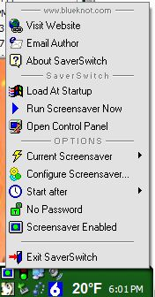



## SaverSwitch FULL Version Screensaver Manager

### Description

Tray icon can select & configure screensaver, run with double-click or temporarily enable/disable the saver with a single click.

This version has a list of all the screensavers in the system & windows directory WITH THE PROPER NAMES as listed on the display settings panel. (thanks to 'Ark' for pointing me in the right direction here.) Also options for setting timeout, password protection and launching configuration dialog (if there is one--might just start SS if there isn't...)

Also avoided the problem with last version that made it appear you could run the SS when none was available.

Several new options and icons (CoolMenu system)

VB5 users will need a function to replace Replace$().

Old version is still available for those who want the tiny & simple app (http://www.Planet-Source-Code.com/vb/default.asp?lngCId=43788&lngWId=1)
 
### More Info
 

             |
---                |---
**Submitted On**   |2003-03-10 17:52:58
**By**             |[Dan Redding \- Blue Knot Software](https://github.com/Planet-Source-Code/PSCIndex/blob/master/ByAuthor/dan-redding-blue-knot-software.md)
**Level**          |Intermediate
**User Rating**    |5.0 (10 globes from 2 users)
**Compatibility**  |VB 5\.0, VB 6\.0
**Category**       |[Complete Applications](https://github.com/Planet-Source-Code/PSCIndex/blob/master/ByCategory/complete-applications__1-27.md)
**World**          |[Visual Basic](https://github.com/Planet-Source-Code/PSCIndex/blob/master/ByWorld/visual-basic.md)
**Archive File**   |[SaverSwitc1557643102003\.zip](https://github.com/Planet-Source-Code/dan-redding-blue-knot-software-saverswitch-full-version-screensaver-manager__1-43915/archive/master.zip)

